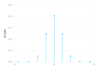
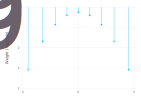
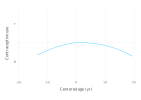
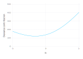
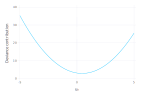
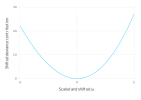
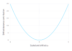
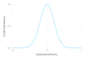
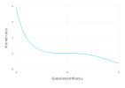
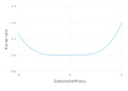

# Normalized Gauss-Hermite Quadrature {#Normalized-Gauss-Hermite-Quadrature}

[_Gaussian Quadrature rules_](https://en.wikipedia.org/wiki/Gaussian_quadrature) provide sets of `x` values, called _abscissae_, and corresponding weights, `w`, to approximate an integral with respect to a _weight function_, $g(x)$. For a `k`th order rule the approximation is

$$\int f(x)g(x)\,dx \approx \sum_{i=1}^k w_i f(x_i)$$

For the _Gauss-Hermite_ rule the weight function is

$$g(x) = e^{-x^2}$$

and the domain of integration is $(-\infty, \infty)$. A slight variation of this is the _normalized Gauss-Hermite_ rule for which the weight function is the standard normal density

$$g(z) = \phi(z) = \frac{e^{-z^2/2}}{\sqrt{2\pi}}$$

Thus, the expected value of $f(z)$, where $\mathcal{Z}\sim\mathscr{N}(0,1)$, is approximated as

$$\mathbb{E}[f]=\int_{-\infty}^{\infty} f(z) \phi(z)\,dz\approx\sum_{i=1}^k w_i\,f(z_i) .$$

Naturally, there is a caveat. For the approximation to be accurate the function $f(z)$ must behave like a low-order polynomial over the range of interest. More formally, a `k`th order rule is exact when `f` is a polynomial of order `2k-1` or less. [^1]

## Evaluating the weights and abscissae {#Evaluating-the-weights-and-abscissae}

In the [_Golub-Welsch algorithm_](https://en.wikipedia.org/wiki/Gaussian_quadrature#The_Golub-Welsch_algorithm) the abscissae for a particular Gaussian quadrature rule are determined as the eigenvalues of a symmetric tri-diagonal matrix and the weights are derived from the squares of the first row of the matrix of eigenvectors. For a `k`th order normalized Gauss-Hermite rule the tridiagonal matrix has zeros on the diagonal and the square roots of `1:k-1` on the super- and sub-diagonal, e.g.

```julia
using DataFrames, LinearAlgebra, Gadfly
sym3 = SymTridiagonal(zeros(3), sqrt.(1:2))
ev = eigen(sym3);
ev.values
```


```
3-element Vector{Float64}:
 -1.7320508075688739
  1.1102230246251565e-15
  1.7320508075688774
```


```julia
abs2.(ev.vectors[1,:])
```


```
3-element Vector{Float64}:
 0.16666666666666735
 0.6666666666666657
 0.16666666666666677
```


As a function of `k` this can be written as

```julia
function gausshermitenorm(k)
    ev = eigen(SymTridiagonal(zeros(k), sqrt.(1:k-1)))
    ev.values, abs2.(ev.vectors[1,:])
end;
```


```
gausshermitenorm (generic function with 1 method)
```


providing

```julia
gausshermitenorm(3)
```


```
([-1.7320508075688739, 1.1102230246251565e-15, 1.7320508075688774], [0.16666666666666735, 0.6666666666666657, 0.16666666666666677])
```


The weights and positions are often shown as a _lollipop plot_. For the 9th order rule these are

```julia
gh9=gausshermitenorm(9)
plot(x=gh9[1], y=gh9[2], Geom.hair, Geom.point, Guide.ylabel("Weight"), Guide.xlabel(""))
```



Notice that the magnitudes of the weights drop quite dramatically away from zero, even on a logarithmic scale

```julia
plot(
    x=gh9[1], y=gh9[2], Geom.hair, Geom.point,
    Scale.y_log2, Guide.ylabel("Weight (log scale)"),
    Guide.xlabel(""),
)
```



The definition of `MixedModels.GHnorm` is similar to the `gausshermitenorm` function with some extra provisions for ensuring symmetry of the abscissae and the weights and for caching values once they have been calculated.
<details class='jldocstring custom-block' open>
<summary><a id='MixedModels.GHnorm' href='#MixedModels.GHnorm'><span class="jlbinding">MixedModels.GHnorm</span></a> <Badge type="info" class="jlObjectType jlFunction" text="Function" /></summary>


```julia
GHnorm(k::Int)
```


Return the (unique) GaussHermiteNormalized{k} object.

The function values are stored (memoized) when first evaluated.  Subsequent evaluations for the same `k` have very low overhead.


<Badge type="info" class="source-link" text="source"><a href="https://github.com/JuliaStats/MixedModels.jl/blob/v4.31.0/src/gausshermite.jl#L72-L79" target="_blank" rel="noreferrer">source</a></Badge>

</details>


```julia
using MixedModels
GHnorm(3)
```


```
MixedModels.GaussHermiteNormalized{3}([-1.7320508075688772, 0.0, 1.7320508075688772], [0.16666666666666666, 0.6666666666666666, 0.16666666666666666])
```


By the properties of the normal distribution, when $\mathcal{X}\sim\mathscr{N}(\mu, \sigma^2)$

$$\mathbb{E}[g(x)] \approx \sum_{i=1}^k g(\mu + \sigma z_i)\,w_i$$

For example, $\mathbb{E}[\mathcal{X}^2]$ where $\mathcal{X}\sim\mathcal{N}(2, 3^2)$ is

```julia
μ = 2; σ = 3; ghn3 = GHnorm(3);
sum(@. ghn3.w * abs2(μ + σ * ghn3.z))  # should be μ² + σ² = 13
```


```
13.0
```


(In general a dot, &#39;`.`&#39;, after the function name in a function call, as in `abs2.(...)`, or before an operator creates a [_fused vectorized_](https://docs.julialang.org/en/v1/manual/performance-tips/#More-dots:-Fuse-vectorized-operations-1) evaluation in Julia. The macro `@.` has the effect of vectorizing all operations in the subsequent expression.)

## Application to a model for contraception use {#Application-to-a-model-for-contraception-use}

A _binary response_ is a &quot;Yes&quot;/&quot;No&quot; type of answer. For example, in a 1989 fertility survey of women in Bangladesh (reported in [Huq, N. M. and Cleland, J., 1990](https://www.popline.org/node/371841)) one response of interest was whether the woman used artificial contraception. Several covariates were recorded including the woman&#39;s age (centered at the mean), the number of live children the woman has had (in 4 categories: 0, 1, 2, and 3 or more), whether she lived in an urban setting, and the district in which she lived. The version of the data used here is that used in review of multilevel modeling software conducted by the Center for Multilevel Modelling, currently at University of Bristol (http://www.bristol.ac.uk/cmm/learning/mmsoftware/data-rev.html). These data are available as the `:contra` dataset.

```julia
contra = DataFrame(MixedModels.dataset(:contra))
describe(contra)
```

<div v-html="`&lt;div&gt;&lt;div style = &quot;float: left;&quot;&gt;&lt;span&gt;5×7 DataFrame&lt;/span&gt;&lt;/div&gt;&lt;div style = &quot;clear: both;&quot;&gt;&lt;/div&gt;&lt;/div&gt;&lt;div class = &quot;data-frame&quot; style = &quot;overflow-x: scroll;&quot;&gt;&lt;table class = &quot;data-frame&quot; style = &quot;margin-bottom: 6px;&quot;&gt;&lt;thead&gt;&lt;tr class = &quot;header&quot;&gt;&lt;th class = &quot;rowNumber&quot; style = &quot;font-weight: bold; text-align: right;&quot;&gt;Row&lt;/th&gt;&lt;th style = &quot;text-align: left;&quot;&gt;variable&lt;/th&gt;&lt;th style = &quot;text-align: left;&quot;&gt;mean&lt;/th&gt;&lt;th style = &quot;text-align: left;&quot;&gt;min&lt;/th&gt;&lt;th style = &quot;text-align: left;&quot;&gt;median&lt;/th&gt;&lt;th style = &quot;text-align: left;&quot;&gt;max&lt;/th&gt;&lt;th style = &quot;text-align: left;&quot;&gt;nmissing&lt;/th&gt;&lt;th style = &quot;text-align: left;&quot;&gt;eltype&lt;/th&gt;&lt;/tr&gt;&lt;tr class = &quot;subheader headerLastRow&quot;&gt;&lt;th class = &quot;rowNumber&quot; style = &quot;font-weight: bold; text-align: right;&quot;&gt;&lt;/th&gt;&lt;th title = &quot;Symbol&quot; style = &quot;text-align: left;&quot;&gt;Symbol&lt;/th&gt;&lt;th title = &quot;Union{Nothing, Float64}&quot; style = &quot;text-align: left;&quot;&gt;Union…&lt;/th&gt;&lt;th title = &quot;Any&quot; style = &quot;text-align: left;&quot;&gt;Any&lt;/th&gt;&lt;th title = &quot;Union{Nothing, Float64}&quot; style = &quot;text-align: left;&quot;&gt;Union…&lt;/th&gt;&lt;th title = &quot;Any&quot; style = &quot;text-align: left;&quot;&gt;Any&lt;/th&gt;&lt;th title = &quot;Int64&quot; style = &quot;text-align: left;&quot;&gt;Int64&lt;/th&gt;&lt;th title = &quot;DataType&quot; style = &quot;text-align: left;&quot;&gt;DataType&lt;/th&gt;&lt;/tr&gt;&lt;/thead&gt;&lt;tbody&gt;&lt;tr&gt;&lt;td class = &quot;rowNumber&quot; style = &quot;font-weight: bold; text-align: right;&quot;&gt;1&lt;/td&gt;&lt;td style = &quot;text-align: left;&quot;&gt;dist&lt;/td&gt;&lt;td style = &quot;font-style: italic; text-align: left;&quot;&gt;&lt;/td&gt;&lt;td style = &quot;text-align: left;&quot;&gt;D01&lt;/td&gt;&lt;td style = &quot;font-style: italic; text-align: left;&quot;&gt;&lt;/td&gt;&lt;td style = &quot;text-align: left;&quot;&gt;D61&lt;/td&gt;&lt;td style = &quot;text-align: right;&quot;&gt;0&lt;/td&gt;&lt;td style = &quot;text-align: left;&quot;&gt;String&lt;/td&gt;&lt;/tr&gt;&lt;tr&gt;&lt;td class = &quot;rowNumber&quot; style = &quot;font-weight: bold; text-align: right;&quot;&gt;2&lt;/td&gt;&lt;td style = &quot;text-align: left;&quot;&gt;urban&lt;/td&gt;&lt;td style = &quot;font-style: italic; text-align: left;&quot;&gt;&lt;/td&gt;&lt;td style = &quot;text-align: left;&quot;&gt;N&lt;/td&gt;&lt;td style = &quot;font-style: italic; text-align: left;&quot;&gt;&lt;/td&gt;&lt;td style = &quot;text-align: left;&quot;&gt;Y&lt;/td&gt;&lt;td style = &quot;text-align: right;&quot;&gt;0&lt;/td&gt;&lt;td style = &quot;text-align: left;&quot;&gt;String&lt;/td&gt;&lt;/tr&gt;&lt;tr&gt;&lt;td class = &quot;rowNumber&quot; style = &quot;font-weight: bold; text-align: right;&quot;&gt;3&lt;/td&gt;&lt;td style = &quot;text-align: left;&quot;&gt;livch&lt;/td&gt;&lt;td style = &quot;font-style: italic; text-align: left;&quot;&gt;&lt;/td&gt;&lt;td style = &quot;text-align: left;&quot;&gt;0&lt;/td&gt;&lt;td style = &quot;font-style: italic; text-align: left;&quot;&gt;&lt;/td&gt;&lt;td style = &quot;text-align: left;&quot;&gt;3+&lt;/td&gt;&lt;td style = &quot;text-align: right;&quot;&gt;0&lt;/td&gt;&lt;td style = &quot;text-align: left;&quot;&gt;String&lt;/td&gt;&lt;/tr&gt;&lt;tr&gt;&lt;td class = &quot;rowNumber&quot; style = &quot;font-weight: bold; text-align: right;&quot;&gt;4&lt;/td&gt;&lt;td style = &quot;text-align: left;&quot;&gt;age&lt;/td&gt;&lt;td style = &quot;text-align: left;&quot;&gt;0.00204757&lt;/td&gt;&lt;td style = &quot;text-align: left;&quot;&gt;-13.56&lt;/td&gt;&lt;td style = &quot;text-align: left;&quot;&gt;-1.56&lt;/td&gt;&lt;td style = &quot;text-align: left;&quot;&gt;19.44&lt;/td&gt;&lt;td style = &quot;text-align: right;&quot;&gt;0&lt;/td&gt;&lt;td style = &quot;text-align: left;&quot;&gt;Float64&lt;/td&gt;&lt;/tr&gt;&lt;tr&gt;&lt;td class = &quot;rowNumber&quot; style = &quot;font-weight: bold; text-align: right;&quot;&gt;5&lt;/td&gt;&lt;td style = &quot;text-align: left;&quot;&gt;use&lt;/td&gt;&lt;td style = &quot;font-style: italic; text-align: left;&quot;&gt;&lt;/td&gt;&lt;td style = &quot;text-align: left;&quot;&gt;N&lt;/td&gt;&lt;td style = &quot;font-style: italic; text-align: left;&quot;&gt;&lt;/td&gt;&lt;td style = &quot;text-align: left;&quot;&gt;Y&lt;/td&gt;&lt;td style = &quot;text-align: right;&quot;&gt;0&lt;/td&gt;&lt;td style = &quot;text-align: left;&quot;&gt;String&lt;/td&gt;&lt;/tr&gt;&lt;/tbody&gt;&lt;/table&gt;&lt;/div&gt;`"></div>

A smoothed scatterplot of contraception use versus age

```julia
plot(contra, x=:age, y=:use, Geom.smooth, Guide.xlabel("Centered age (yr)"),
    Guide.ylabel("Contraception use"))
```



shows that the proportion of women using artificial contraception is approximately quadratic in age.

A model with fixed-effects for age, age squared, number of live children and urban location and with random effects for district, is fit as

```julia
const form1 = @formula use ~ 1 + age + abs2(age) + livch + urban + (1|dist);
m1 = fit(MixedModel, form1, contra, Bernoulli(), fast=true)
```


```
Generalized Linear Mixed Model fit by maximum likelihood (nAGQ = 1)
  use ~ 1 + age + :(abs2(age)) + livch + urban + (1 | dist)
  Distribution: Bernoulli{Float64}
  Link: LogitLink()

   logLik    deviance     AIC       AICc        BIC    
 -1186.3922  2372.7844  2388.7844  2388.8592  2433.3231

Variance components:
        Column   VarianceStd.Dev.
dist (Intercept)  0.22533 0.47469

 Number of obs: 1934; levels of grouping factors: 60

Fixed-effects parameters:
──────────────────────────────────────────────────────
                   Coef.   Std. Error      z  Pr(>|z|)
──────────────────────────────────────────────────────
(Intercept)  -1.01528     0.173972     -5.84    <1e-08
age           0.00351074  0.00921014    0.38    0.7031
abs2(age)    -0.0044865   0.000722797  -6.21    <1e-09
livch: 1      0.801876    0.161867      4.95    <1e-06
livch: 2      0.901014    0.184771      4.88    <1e-05
livch: 3+     0.899415    0.1854        4.85    <1e-05
urban: Y      0.684404    0.119684      5.72    <1e-07
──────────────────────────────────────────────────────
```


For a model such as `m1`, which has a single, scalar random-effects term, the unscaled conditional density of the spherical random effects variable, $\mathcal{U}$, given the observed data, $\mathcal{Y}=\mathbf{y}_0$, can be expressed as a product of scalar density functions, $f_i(u_i),\; i=1,\dots,q$. In the PIRLS algorithm, which determines the conditional mode vector, $\tilde{\mathbf{u}}$, the optimization is performed on the _deviance scale_,

$$D(\mathbf{u})=-2\sum_{i=1}^q \log(f_i(u_i))$$

The objective, $D$, consists of two parts: the sum of the (squared) _deviance residuals_, measuring fidelity to the data, and the squared length of $\mathbf{u}$, which is the penalty. In the PIRLS algorithm, only the sum of these components is needed. To use Gauss-Hermite quadrature the contributions of each of the $u_i,\;i=1,\dots,q$ should be separately evaluated.

```julia
const devc0 = map!(abs2, m1.devc0, m1.u[1]);  # start with uᵢ²
const devresid = m1.resp.devresid;   # n-dimensional vector of deviance residuals
const refs = only(m1.LMM.reterms).refs;  # n-dimensional vector of indices in 1:q
for (dr, i) in zip(devresid, refs)
    devc0[i] += dr
end
show(devc0)
```


```
[121.29248010592431, 22.022573374684466, 2.9189004603395574, 30.78771776559348, 47.54204966823043, 69.55502458610148, 23.404687156598516, 46.27907378658085, 24.45278090406325, 7.759490604143492, 9.773662462621793, 42.759035746060306, 27.55249433220464, 156.42045134534524, 26.19246853349222, 27.416249289384243, 24.538088908183703, 57.56615452424064, 31.17940371393331, 22.341558784617607, 27.478094806108732, 19.988456647947093, 16.010854754708884, 9.7614790497736, 83.8634940079337, 15.568769290067616, 42.759683177855436, 51.46851376955705, 32.73334458640859, 70.41572380082265, 39.68586971897773, 27.544104127423946, 14.697567285366214, 53.04735403406631, 64.84964758824393, 19.74388066578949, 19.415516145111216, 11.242285666542704, 37.416774863657274, 54.26508057348639, 39.58249524909929, 17.398404721611406, 60.22781277574248, 28.819185811633446, 42.44425503199142, 112.99129199874471, 17.297702180066803, 51.57734311518058, 2.18721383069587, 22.96155935805146, 47.4144756876347, 87.23162385488926, 25.923443753232256, 9.470291347677948, 61.17586303966283, 27.102818183078504, 48.01617448432921, 8.460202658794927, 30.365222091645382, 47.37415951715057]
```


One thing to notice is that, even on the deviance scale, the contributions of different districts can be of different magnitudes. This is primarily due to different sample sizes in the different districts.

```julia
using FreqTables
freqtable(contra, :dist)'
```


```
1×60 Named LinearAlgebra.Adjoint{Int64, Vector{Int64}}
' ╲ dist │ D01  D02  D03  D04  D05  D06  …  D56  D57  D58  D59  D60  D61
─────────┼──────────────────────────────────────────────────────────────
1        │ 117   20    2   30   39   65  …   45   27   33   10   32   42
```


Because the first district has one of the largest sample sizes and the third district has the smallest sample size, these two will be used for illustration. For a range of $u$ values, evaluate the individual components of the deviance and store them in a matrix.

```julia
const devc = m1.devc;
const xvals = -5.0:2.0^(-4):5.0;
const uv = vec(m1.u[1]);
const u₀ = vec(m1.u₀[1]);
results = zeros(length(devc0), length(xvals))
for (j, u) in enumerate(xvals)
    fill!(devc, abs2(u))
    fill!(uv, u)
    MixedModels.updateη!(m1)
    for (dr, i) in zip(devresid, refs)
        devc[i] += dr
    end
    copyto!(view(results, :, j), devc)
end
```


A plot of the deviance contribution versus $u_1$

```julia
plot(x=xvals, y=view(results, 1, :), Geom.line, Guide.xlabel("u₁"),
    Guide.ylabel("Deviance contribution"))
```



shows that the deviance contribution is very close to a quadratic. This is also true for $u_3$

```julia
plot(x=xvals, y=view(results, 3, :), Geom.line, Guide.xlabel("u₃"),
    Guide.ylabel("Deviance contribution"))
```



The PIRLS algorithm provides the locations of the minima of these scalar functions, stored as

```julia
m1.u₀[1]
```


```
1×60 Matrix{Float64}:
 -1.58477  -0.0727267  0.449058  0.341589  …  -0.767069  -0.902922  -1.06625
```


the minima themselves, evaluated as `devc0` above, and a horizontal scale, which is the inverse of diagonal of the Cholesky factor. As shown below, this is an estimate of the conditional standard deviations of the components of $\mathcal{U}$.

```julia
using MixedModels: block
const s = inv.(m1.LMM.L[block(1,1)].diag);
s'
```


```
1×60 adjoint(::Vector{Float64}) with eltype Float64:
 0.406888  0.713511  0.952164  0.627134  …  0.839678  0.654964  0.603258
```


The curves can be put on a common scale, corresponding to the standard normal, as

```julia
for (j, z) in enumerate(xvals)
    @. uv = u₀ + z * s
    MixedModels.updateη!(m1)
    @. devc = abs2(uv) - devc0
    for (dr, i) in zip(devresid, refs)
        devc[i] += dr
    end
    copyto!(view(results, :, j), devc)
end
```


```julia
plot(x=xvals, y=view(results, 1, :), Geom.line,
    Guide.xlabel("Scaled and shifted u₁"),
    Guide.ylabel("Shifted deviance contribution"))
```



```julia
plot(x=xvals, y=view(results, 3, :), Geom.line,
    Guide.xlabel("Scaled and shifted u₃"),
    Guide.ylabel("Shifted deviance contribution"))
```



On the original density scale these become

```julia
for (j, z) in enumerate(xvals)
    @. uv = u₀ + z * s
    MixedModels.updateη!(m1)
    @. devc = abs2(uv) - devc0
    for (dr, i) in zip(devresid, refs)
        devc[i] += dr
    end
    copyto!(view(results, :, j), @. exp(-devc/2))
end
```


```julia
plot(x=xvals, y=view(results, 1, :), Geom.line,
    Guide.xlabel("Scaled and shifted u₁"),
    Guide.ylabel("Conditional density"))
```



```julia
plot(x=xvals, y=view(results, 3, :), Geom.line,
    Guide.xlabel("Scaled and shifted u₃"),
    Guide.ylabel("Conditional density"))
```


and the function to be integrated with the normalized Gauss-Hermite rule is

```julia
for (j, z) in enumerate(xvals)
    @. uv = u₀ + z * s
    MixedModels.updateη!(m1)
    @. devc = abs2(uv) - devc0
    for (dr, i) in zip(devresid, refs)
        devc[i] += dr
    end
    copyto!(view(results, :, j), @. exp((abs2(z) - devc)/2))
end
```


```julia
plot(x=xvals, y=view(results, 1, :), Geom.line,
    Guide.xlabel("Scaled and shifted u₁"), Guide.ylabel("Kernel ratio"))
```



```julia
plot(x=xvals, y=view(results, 3, :), Geom.line,
    Guide.xlabel("Scaled and shifted u₃"), Guide.ylabel("Kernel ratio"))
```



[^1]: https://en.wikipedia.org/wiki/Gaussian_quadrature

