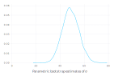
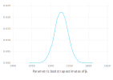
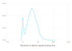
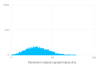
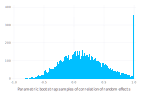

# Parametric bootstrap for mixed-effects models {#Parametric-bootstrap-for-mixed-effects-models}

Julia is well-suited to implementing bootstrapping and other simulation-based methods for statistical models. The `parametricbootstrap` function in the [MixedModels package](https://github.com/JuliaStats/MixedModels.jl) provides an efficient parametric bootstrap for mixed-effects models.
<details class='jldocstring custom-block' open>
<summary><a id='MixedModels.parametricbootstrap' href='#MixedModels.parametricbootstrap'><span class="jlbinding">MixedModels.parametricbootstrap</span></a> <Badge type="info" class="jlObjectType jlFunction" text="Function" /></summary>


```julia
parametricbootstrap([rng::AbstractRNG], nsamp::Integer, m::MixedModel{T}, ftype=T;
    β = fixef(m), σ = m.σ, θ = m.θ, progress=true, optsum_overrides=(;))
```


Perform `nsamp` parametric bootstrap replication fits of `m`, returning a `MixedModelBootstrap`.

The default random number generator is `Random.GLOBAL_RNG`.

`ftype` can be used to store the computed bootstrap values in a lower precision. `ftype` is not a named argument because named arguments are not used in method dispatch and thus specialization. In other words, having `ftype` as a positional argument has some potential performance benefits.

**Keyword Arguments**
- `β`, `σ`, and `θ` are the values of `m`&#39;s parameters for simulating the responses.
  
- `σ` is only valid for `LinearMixedModel` and `GeneralizedLinearMixedModel` for
  

families with a dispersion parameter.
- `progress` controls whether the progress bar is shown. Note that the progress
  

bar is automatically disabled for non-interactive (i.e. logging) contexts.
- `optsum_overrides` is used to override values of [OptSummary](/api#MixedModels.OptSummary) in the models
  

fit during the bootstrapping process. For example, `optsum_overrides=(;ftol_rel=1e-08)` reduces the convergence criterion, which can greatly speed up the bootstrap fits. Taking advantage of this speed up to increase `n` can often lead to better estimates of coverage intervals.

::: tip Note

All coefficients are bootstrapped. In the rank deficient case, the inestimatable coefficients are treated as -0.0 in the simulations underlying the bootstrap, which will generally result in their estimate from the simulated data also being being inestimable and thus set to -0.0. **However this behavior may change in future releases to explicitly drop the extraneous columns before simulation and thus not include their estimates in the bootstrap result.**

:::


<Badge type="info" class="source-link" text="source"><a href="https://github.com/JuliaStats/MixedModels.jl/blob/v4.31.0/src/bootstrap.jl#L178-L211" target="_blank" rel="noreferrer">source</a></Badge>

</details>


## The parametric bootstrap {#The-parametric-bootstrap}

[Bootstrapping](https://en.wikipedia.org/wiki/Bootstrapping_(statistics)) is a family of procedures for generating sample values of a statistic, allowing for visualization of the distribution of the statistic or for inference from this sample of values.

A _parametric bootstrap_ is used with a parametric model, `m`, that has been fit to data. The procedure is to simulate `n` response vectors from `m` using the estimated parameter values and refit `m` to these responses in turn, accumulating the statistics of interest at each iteration.

The parameters of a `LinearMixedModel` object are the fixed-effects parameters, `β`, the standard deviation, `σ`, of the per-observation noise, and the covariance parameter, `θ`, that defines the variance-covariance matrices of the random effects.

For example, a simple linear mixed-effects model for the `Dyestuff` data in the [`lme4`](http://github.com/lme4/lme4) package for [`R`](https://www.r-project.org) is fit by

```julia
using DataFrames
using Gadfly          # plotting package
using MixedModels
using Random
```


```julia
dyestuff = MixedModels.dataset(:dyestuff)
m1 = fit(MixedModel, @formula(yield ~ 1 + (1 | batch)), dyestuff)
```

<div v-html="`&lt;table&gt;&lt;tr&gt;&lt;th align=&quot;left&quot;&gt;&lt;/th&gt;&lt;th align=&quot;right&quot;&gt;Est.&lt;/th&gt;&lt;th align=&quot;right&quot;&gt;SE&lt;/th&gt;&lt;th align=&quot;right&quot;&gt;z&lt;/th&gt;&lt;th align=&quot;right&quot;&gt;p&lt;/th&gt;&lt;th align=&quot;right&quot;&gt;σ_batch&lt;/th&gt;&lt;/tr&gt;&lt;tr&gt;&lt;td align=&quot;left&quot;&gt;&amp;#40;Intercept&amp;#41;&lt;/td&gt;&lt;td align=&quot;right&quot;&gt;1527.5000&lt;/td&gt;&lt;td align=&quot;right&quot;&gt;17.6946&lt;/td&gt;&lt;td align=&quot;right&quot;&gt;86.33&lt;/td&gt;&lt;td align=&quot;right&quot;&gt;&amp;lt;1e-99&lt;/td&gt;&lt;td align=&quot;right&quot;&gt;37.2603&lt;/td&gt;&lt;/tr&gt;&lt;tr&gt;&lt;td align=&quot;left&quot;&gt;Residual&lt;/td&gt;&lt;td align=&quot;right&quot;&gt;49.5101&lt;/td&gt;&lt;td align=&quot;right&quot;&gt;&lt;/td&gt;&lt;td align=&quot;right&quot;&gt;&lt;/td&gt;&lt;td align=&quot;right&quot;&gt;&lt;/td&gt;&lt;td align=&quot;right&quot;&gt;&lt;/td&gt;&lt;/tr&gt;&lt;/table&gt;&#10;`"></div>

To bootstrap the model parameters, first initialize a random number generator then create a bootstrap sample and extract the `tbl` property, which is a `Table` - a lightweight dataframe-like object.

```julia
const rng = MersenneTwister(1234321);
samp = parametricbootstrap(rng, 10_000, m1);
tbl = samp.tbl
```


```
Table with 5 columns and 10000 rows:
      obj      β1       σ        σ1       θ1
    ┌─────────────────────────────────────────────
 1  │ 316.738  1528.14  43.5735  22.6691  0.520249
 2  │ 336.101  1552.01  58.1535  39.5166  0.679521
 3  │ 322.046  1501.55  51.857   0.0      0.0
 4  │ 326.893  1525.24  43.6512  66.3744  1.52056
 5  │ 331.544  1522.05  50.7415  51.0074  1.00524
 6  │ 326.892  1550.23  53.5174  19.0928  0.356759
 7  │ 313.786  1504.16  45.1878  0.0      0.0
 8  │ 322.636  1494.05  49.8556  17.7732  0.356494
 9  │ 323.582  1529.74  46.4678  35.2094  0.757716
 10 │ 321.639  1532.6   45.3573  32.4904  0.71632
 11 │ 331.565  1548.25  55.8562  28.7512  0.514736
 12 │ 310.076  1481.8   34.9418  38.4381  1.10006
 13 │ 314.492  1541.95  40.3751  28.3694  0.702646
 14 │ 340.876  1530.48  63.006   42.6409  0.676776
 15 │ 309.778  1496.17  41.5411  8.08346  0.19459
 16 │ 335.375  1530.32  57.4864  38.9066  0.676797
 17 │ 318.347  1511.28  41.0926  39.1128  0.951821
 ⋮  │    ⋮        ⋮        ⋮        ⋮        ⋮
```


A density plot of the estimates of `σ`, the residual standard deviation, can be created as

```julia
plot(x = tbl.σ, Geom.density, Guide.xlabel("Parametric bootstrap estimates of σ"))
```



or, for the intercept parameter

```julia
plot(x = tbl.β1, Geom.density, Guide.xlabel("Parametric bootstrap estimates of β₁"))
```



A density plot of the estimates of the standard deviation of the random effects is obtained as

```julia
plot(x = tbl.σ1, Geom.density,
    Guide.xlabel("Parametric bootstrap estimates of σ₁"))
```



Notice that this density plot has a spike, or mode, at zero. Although this mode appears to be diffuse, this is an artifact of the way that density plots are created. In fact, it is a pulse, as can be seen from a histogram.

```julia
plot(x = tbl.σ1, Geom.histogram,
    Guide.xlabel("Parametric bootstrap estimates of σ₁"))
```



The bootstrap sample can be used to generate intervals that cover a certain percentage of the bootstrapped values. We refer to these as &quot;coverage intervals&quot;, similar to a confidence interval. The shortest such intervals, obtained with the `shortestcovint` extractor, correspond to a highest posterior density interval in Bayesian inference.
<details class='jldocstring custom-block' open>
<summary><a id='MixedModels.shortestcovint' href='#MixedModels.shortestcovint'><span class="jlbinding">MixedModels.shortestcovint</span></a> <Badge type="info" class="jlObjectType jlFunction" text="Function" /></summary>


```julia
shortestcovint(v, level = 0.95)
```


Return the shortest interval containing `level` proportion of the values of `v`


<Badge type="info" class="source-link" text="source"><a href="https://github.com/JuliaStats/MixedModels.jl/blob/v4.31.0/src/bootstrap.jl#L475-L479" target="_blank" rel="noreferrer">source</a></Badge>


```julia
shortestcovint(bsamp::MixedModelFitCollection, level = 0.95)
```


Return the shortest interval containing `level` proportion for each parameter from `bsamp.allpars`.

::: warning Warning

Currently, correlations that are systematically zero are included in the the result. This may change in a future release without being considered a breaking change.

:::


<Badge type="info" class="source-link" text="source"><a href="https://github.com/JuliaStats/MixedModels.jl/blob/v4.31.0/src/bootstrap.jl#L495-L504" target="_blank" rel="noreferrer">source</a></Badge>

</details>


We generate these directly from the original bootstrap object:

```julia
Table(shortestcovint(samp))
```


```
Table with 5 columns and 3 rows:
     type  group     names        lower    upper
   ┌──────────────────────────────────────────────
 1 │ β     missing   (Intercept)  1491.05  1560.55
 2 │ σ     batch     (Intercept)  0.0      54.5795
 3 │ σ     residual  missing      35.5329  62.4926
```


A value of zero for the standard deviation of the random effects is an example of a _singular_ covariance. It is easy to detect the singularity in the case of a scalar random-effects term. However, it is not as straightforward to detect singularity in vector-valued random-effects terms.

For example, if we bootstrap a model fit to the `sleepstudy` data

```julia
sleepstudy = MixedModels.dataset(:sleepstudy)
contrasts = Dict(:subj => Grouping())
m2 = let f = @formula reaction ~ 1+days+(1+days|subj)
    fit(MixedModel, f, sleepstudy; contrasts)
end
```

<div v-html="`&lt;table&gt;&lt;tr&gt;&lt;th align=&quot;left&quot;&gt;&lt;/th&gt;&lt;th align=&quot;right&quot;&gt;Est.&lt;/th&gt;&lt;th align=&quot;right&quot;&gt;SE&lt;/th&gt;&lt;th align=&quot;right&quot;&gt;z&lt;/th&gt;&lt;th align=&quot;right&quot;&gt;p&lt;/th&gt;&lt;th align=&quot;right&quot;&gt;σ_subj&lt;/th&gt;&lt;/tr&gt;&lt;tr&gt;&lt;td align=&quot;left&quot;&gt;&amp;#40;Intercept&amp;#41;&lt;/td&gt;&lt;td align=&quot;right&quot;&gt;251.4051&lt;/td&gt;&lt;td align=&quot;right&quot;&gt;6.6323&lt;/td&gt;&lt;td align=&quot;right&quot;&gt;37.91&lt;/td&gt;&lt;td align=&quot;right&quot;&gt;&amp;lt;1e-99&lt;/td&gt;&lt;td align=&quot;right&quot;&gt;23.7805&lt;/td&gt;&lt;/tr&gt;&lt;tr&gt;&lt;td align=&quot;left&quot;&gt;days&lt;/td&gt;&lt;td align=&quot;right&quot;&gt;10.4673&lt;/td&gt;&lt;td align=&quot;right&quot;&gt;1.5022&lt;/td&gt;&lt;td align=&quot;right&quot;&gt;6.97&lt;/td&gt;&lt;td align=&quot;right&quot;&gt;&amp;lt;1e-11&lt;/td&gt;&lt;td align=&quot;right&quot;&gt;5.7168&lt;/td&gt;&lt;/tr&gt;&lt;tr&gt;&lt;td align=&quot;left&quot;&gt;Residual&lt;/td&gt;&lt;td align=&quot;right&quot;&gt;25.5918&lt;/td&gt;&lt;td align=&quot;right&quot;&gt;&lt;/td&gt;&lt;td align=&quot;right&quot;&gt;&lt;/td&gt;&lt;td align=&quot;right&quot;&gt;&lt;/td&gt;&lt;td align=&quot;right&quot;&gt;&lt;/td&gt;&lt;/tr&gt;&lt;/table&gt;&#10;`"></div>

```julia
samp2 = parametricbootstrap(rng, 10_000, m2);
tbl2 = samp2.tbl
```


```
Table with 10 columns and 10000 rows:
      obj      β1       β2       σ        σ1       σ2       ρ1            ⋯
    ┌──────────────────────────────────────────────────────────────────────
 1  │ 1722.37  250.895  11.2108  23.7292  30.5601  3.37877  0.411488      ⋯
 2  │ 1739.83  247.783  10.3058  24.5781  25.4753  5.35103  0.169341      ⋯
 3  │ 1766.11  262.917  8.67368  26.8278  29.1042  4.58544  0.299448      ⋯
 4  │ 1753.44  239.594  12.3773  26.4169  23.5469  4.85682  -0.276483     ⋯
 5  │ 1763.1   255.882  12.2247  26.0867  25.0354  6.47175  0.197525      ⋯
 6  │ 1750.25  253.685  11.4426  25.765   25.4656  4.95775  -0.135672     ⋯
 7  │ 1741.06  260.753  11.7569  24.7662  22.4896  6.18852  -0.195575     ⋯
 8  │ 1763.54  265.992  9.65105  26.7659  27.1736  4.60808  0.41623       ⋯
 9  │ 1728.66  254.054  7.96851  22.5055  32.7443  7.31196  -0.22585      ⋯
 10 │ 1743.41  249.924  13.8011  25.4967  24.6412  4.42374  -0.0827561    ⋯
 11 │ 1770.33  245.364  10.4891  26.971   21.6813  6.70116  0.0669261     ⋯
 12 │ 1712.07  248.638  8.90521  23.8102  18.5346  4.1671   1.0           ⋯
 13 │ 1756.39  254.155  11.6857  26.659   22.4518  4.58876  0.716327      ⋯
 14 │ 1766.77  244.488  11.8403  26.3666  25.5431  6.57234  -0.000934562  ⋯
 15 │ 1736.64  248.273  9.54573  23.4296  25.658   7.65951  0.169105      ⋯
 16 │ 1729.64  249.183  6.88315  23.2126  29.8659  5.85546  0.0474053     ⋯
 17 │ 1762.76  255.458  8.14682  27.8165  18.0569  4.26976  0.0949213     ⋯
 ⋮  │    ⋮        ⋮        ⋮        ⋮        ⋮        ⋮          ⋮        ⋱
```


the singularity can be exhibited as a standard deviation of zero or as a correlation of $\pm1$.

```julia
shortestcovint(samp2)
```


```
6-element Vector{NamedTuple{(:type, :group, :names, :lower, :upper)}}:
 (type = "β", group = missing, names = "(Intercept)", lower = 238.62114296228958, upper = 264.77008622888087)
 (type = "β", group = missing, names = "days", lower = 7.678713379429666, upper = 13.499638908887992)
 (type = "σ", group = "subj", names = "(Intercept)", lower = 10.771353181876954, upper = 33.48808668437545)
 (type = "σ", group = "subj", names = "days", lower = 2.9147425023494873, upper = 7.6167848472947215)
 (type = "ρ", group = "subj", names = "(Intercept), days", lower = -0.4114607353123966, upper = 1.0)
 (type = "σ", group = "residual", names = missing, lower = 22.61648805602028, upper = 28.452289496499983)
```


A histogram of the estimated correlations from the bootstrap sample has a spike at `+1`.

```julia
plot(x = tbl2.ρ1, Geom.histogram,
    Guide.xlabel("Parametric bootstrap samples of correlation of random effects"))
```



or, as a count,

```julia
count(tbl2.ρ1 .≈ 1)
```


```
336
```


Close examination of the histogram shows a few values of `-1`.

```julia
count(tbl2.ρ1 .≈ -1)
```


```
0
```


Furthermore there are even a few cases where the estimate of the standard deviation of the random effect for the intercept is zero.

```julia
count(tbl2.σ1 .≈ 0)
```


```
3
```


There is a general condition to check for singularity of an estimated covariance matrix or matrices in a bootstrap sample. The parameter optimized in the estimation is `θ`, the relative covariance parameter. Some of the elements of this parameter vector must be non-negative and, when one of these components is approximately zero, one of the covariance matrices will be singular.

The `issingular` method for a `MixedModel` object that tests if a parameter vector `θ` corresponds to a boundary or singular fit.

This operation is encapsulated in a method for the `issingular` function.

```julia
count(issingular(samp2))
```


```
339
```


## Reduced Precision Bootstrap {#Reduced-Precision-Bootstrap}

`parametricbootstrap` accepts an optional keyword argument `optsum_overrides`, which can be used to override the convergence criteria for bootstrap replicates. One possibility is setting `ftol_rel=1e-8`, i.e., considering the model converged when the relative change in the objective between optimizer iterations is smaller than 0.00000001. This threshold corresponds approximately to the precision from treating the value of the objective as a single precision (`Float32`) number, while not changing the precision of the intermediate computations. The resultant loss in precision will generally be smaller than the variation that the bootstrap captures, but can greatly speed up the fitting process for each replicates, especially for large models. More directly, lowering the fit quality for each replicate will reduce the quality of each replicate, but this may be more than compensated for by the ability to fit a much larger number of replicates in the same time.

```julia
t = @timed parametricbootstrap(MersenneTwister(42), 1000, m2; progress=false)
t.time
```


```
0.359230583
```


```julia
optsum_overrides = (; ftol_rel=1e-8)
t = @timed parametricbootstrap(MersenneTwister(42), 1000, m2; optsum_overrides, progress=false)
t.time
```


```
0.282895292
```


## Distributed Computing and the Bootstrap {#Distributed-Computing-and-the-Bootstrap}

Earlier versions of MixedModels.jl supported a multi-threaded bootstrap via the `use_threads` keyword argument. However, with improved BLAS multithreading, the Julia-level threads often wound up competing with the BLAS threads, leading to no improvement or even a worsening of performance when `use_threads=true`. Nonetheless, the bootstrap is a classic example of an [embarrassingly parallel](https://en.wikipedia.org/wiki/Embarrassingly_parallel) problem and so we provide a few convenience methods for combining results computed separately. In particular, there are `vcat` and an optimized `reduce(::typeof(vcat))` methods for `MixedModelBootstrap` objects. For computers with many processors (as opposed to a single processor with several cores) or for computing clusters, these provide a convenient way to split the computation across nodes.

```julia
using Distributed
# you already have 1 proc by default, so add the number of additional cores with `addprocs`
# you need at least as many RNGs as cores you want to use in parallel
# but you shouldn't use all of your cores because nested within this
# is the multithreading of the linear algebra
# addprocs(1)
@info "Currently using $(nprocs()) processors total and $(nworkers()) for work"

# Load the necessary packages on all workers
# For clusters, you will also need to make sure that the Julia
# environment (Project.toml) is set up and activated on each worker.
@everywhere begin
    using ProgressMeter
    using MixedModels
end
# copy everything to workers
@showprogress for w in workers()
    remotecall_fetch(() -> coefnames(m2), w)
end

# split the replicates across the workers
# this rounds down, so if the number of workers doesn't divide the
# number of replicates, you'll be a few replicates short!
n_replicates = 1000
n_rep_per_worker = n_replicates ÷ nworkers()
# NB: You need a different seed/RNG for each worker otherwise you will
# have copies of the same replicates and not independent replicates!
pb_map = @showprogress pmap(MersenneTwister.(1:nworkers())) do rng
    parametricbootstrap(rng, n_rep_per_worker, m2; optsum_overrides)
end;

# get rid of all the workers
# rmprocs(workers())

confint(reduce(vcat, pb_map))
```


```
DictTable with 2 columns and 6 rows:
 par   lower      upper
 ────┬───────────────────
 β1  │ 238.218    263.636
 β2  │ 7.41896    13.1753
 ρ1  │ -0.392873  1.0
 σ   │ 22.5319    28.5051
 σ1  │ 10.3848    33.8593
 σ2  │ 2.91779    7.65655
```

