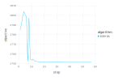

# Details of the parameter estimation {#Details-of-the-parameter-estimation}

## The probability model {#The-probability-model}

Maximum likelihood estimates are based on the probability model for the observed responses. In the probability model the distribution of the responses is expressed as a function of one or more _parameters_.

For a continuous distribution the probability density is a function of the responses, given the parameters. The _likelihood_ function is the same expression as the probability density but regarding the observed values as fixed and the parameters as varying.

In general a mixed-effects model incorporates two random variables: $\mathcal{B}$, the $q$-dimensional vector of random effects, and $\mathcal{Y}$, the $n$-dimensional response vector. The value, $\bf y$, of $\mathcal{Y}$ is observed; the value, $\bf b$, of $\mathcal{B}$ is not.

## Linear Mixed-Effects Models {#Linear-Mixed-Effects-Models}

In a linear mixed model the unconditional distribution of $\mathcal{B}$ and the conditional distribution, $(\mathcal{Y} | \mathcal{B}=\bf{b})$, are both multivariate Gaussian distributions,

$$\begin{aligned}
  (\mathcal{Y} | \mathcal{B}=\bf{b}) &\sim\mathcal{N}(\bf{ X\beta + Z b},\sigma^2\bf{I})\\\\
  \mathcal{B}&\sim\mathcal{N}(\bf{0},\Sigma_\theta) .
\end{aligned}$$

The _conditional mean_ of $\mathcal Y$, given $\mathcal B=\bf b$, is the _linear predictor_, $\bf X\bf\beta+\bf Z\bf b$, which depends on the $p$-dimensional _fixed-effects parameter_, $\bf \beta$, and on $\bf b$. The _model matrices_, $\bf X$ and $\bf Z$, of dimension $n\times p$ and $n\times q$, respectively, are determined from the formula for the model and the values of covariates. Although the matrix $\bf Z$ can be large (i.e. both $n$ and $q$ can be large), it is sparse (i.e. most of the elements in the matrix are zero).

The _relative covariance factor_, $\Lambda_\theta$, is a $q\times q$ lower-triangular matrix, depending on the _variance-component parameter_, $\bf\theta$, and generating the symmetric $q\times q$ variance-covariance matrix, $\Sigma_\theta$, as

$$\Sigma_\theta=\sigma^2\Lambda_\theta\Lambda_\theta'$$

The _spherical random effects_, $\mathcal{U}\sim\mathcal{N}(\bf{0},\sigma^2\bf{I}_q)$, determine $\mathcal B$ according to

$$\mathcal{B}=\Lambda_\theta\mathcal{U}.$$

The _penalized residual sum of squares_ (PRSS),

$$r^2(\theta,\beta,\bf{u})=\|\bf{y} - \bf{X}\beta -\bf{Z}\Lambda_\theta\bf{u}\|^2+\|\bf{u}\|^2,$$

is the sum of the residual sum of squares, measuring fidelity of the model to the data, and a penalty on the size of $\bf u$, measuring the complexity of the model. Minimizing $r^2$ with respect to $\bf u$,

$$r^2_{\beta,\theta} =\min_{\bf{u}}\left(\|\bf{y} -\bf{X}{\beta} -\bf{Z}\Lambda_\theta\bf{u}\|^2+\|\bf{u}\|^2\right)$$

is a direct (i.e. non-iterative) computation. The particular method used to solve this generates a _blocked Choleksy factor_, $\bf{L}_\theta$, which is an lower triangular $q\times q$ matrix satisfying

$$\bf{L}_\theta\bf{L}_\theta'=\Lambda_\theta'\bf{Z}'\bf{Z}\Lambda_\theta+\bf{I}_q .$$

where ${\bf I}_q$ is the $q\times q$ _identity matrix_.

Negative twice the log-likelihood of the parameters, given the data, $\bf y$, is

$$d({\bf\theta},{\bf\beta},\sigma|{\bf y})
=n\log(2\pi\sigma^2)+\log(|{\bf L}_\theta|^2)+\frac{r^2_{\beta,\theta}}{\sigma^2}.$$

where $|{\bf L}_\theta|$ denotes the _determinant_ of ${\bf L}_\theta$. Because ${\bf L}_\theta$ is triangular, its determinant is the product of its diagonal elements.

Because the conditional mean, $\bf\mu_{\mathcal Y|\mathcal B=\bf b}=\bf X\bf\beta+\bf Z\Lambda_\theta\bf u$, is a linear function of both $\bf\beta$ and $\bf u$, minimization of the PRSS with respect to both $\bf\beta$ and $\bf u$ to produce

$$r^2_\theta =\min_{{\bf\beta},{\bf u}}\left(\|{\bf y} -{\bf X}{\bf\beta} -{\bf Z}\Lambda_\theta{\bf u}\|^2+\|{\bf u}\|^2\right)$$

is also a direct calculation. The values of $\bf u$ and $\bf\beta$ that provide this minimum are called, respectively, the _conditional mode_, $\tilde{\bf u}_\theta$, of the spherical random effects and the conditional estimate, $\widehat{\bf\beta}_\theta$, of the fixed effects. At the conditional estimate of the fixed effects the objective is

$$d({\bf\theta},\widehat{\beta}_\theta,\sigma|{\bf y})
=n\log(2\pi\sigma^2)+\log(|{\bf L}_\theta|^2)+\frac{r^2_\theta}{\sigma^2}.$$

Minimizing this expression with respect to $\sigma^2$ produces the conditional estimate

$$\widehat{\sigma^2}_\theta=\frac{r^2_\theta}{n}$$

which provides the _profiled log-likelihood_ on the deviance scale as

$$\tilde{d}(\theta|{\bf y})=d(\theta,\widehat{\beta}_\theta,\widehat{\sigma}_\theta|{\bf y})
=\log(|{\bf L}_\theta|^2)+n\left[1+\log\left(\frac{2\pi r^2_\theta}{n}\right)\right],$$

a function of $\bf\theta$ alone.

The MLE of $\bf\theta$, written $\widehat{\bf\theta}$, is the value that minimizes this profiled objective. We determine this value by numerical optimization. In the process of evaluating $\tilde{d}(\widehat{\theta}|{\bf y})$ we determine $\widehat{\beta}=\widehat{\beta}_{\widehat\theta}$, $\tilde{\bf u}_{\widehat{\theta}}$ and $r^2_{\widehat{\theta}}$, from which we can evaluate $\widehat{\sigma}=\sqrt{r^2_{\widehat{\theta}}/n}$.

The elements of the conditional mode of $\mathcal B$, evaluated at the parameter estimates,

$$\tilde{\bf b}_{\widehat{\theta}}=\Lambda_{\widehat{\theta}}\tilde{\bf u}_{\widehat{\theta}}$$

are sometimes called the _best linear unbiased predictors_ or BLUPs of the random effects. Although BLUPs an appealing acronym, I don’t find the term particularly instructive (what is a “linear unbiased predictor” and in what sense are these the “best”?) and prefer the term “conditional modes”, because these are the values of $\bf b$ that maximize the density of the conditional distribution $\mathcal{B} | \mathcal{Y} = {\bf y}$. For a linear mixed model, where all the conditional and unconditional distributions are Gaussian, these values are also the _conditional means_.

## Internal structure of $\Lambda_\theta$ and $\bf Z$ {#Internal-structure-of-\Lambda_\theta-and-\bf-Z}

In the types of `LinearMixedModel` available through the `MixedModels` package, groups of random effects and the corresponding columns of the model matrix, $\bf Z$, are associated with _random-effects terms_ in the model formula.

For the simple example

```julia
using BenchmarkTools, DataFrames, MixedModels
```


```julia
dyestuff = MixedModels.dataset(:dyestuff)
fm1 = fit(MixedModel, @formula(yield ~ 1 + (1|batch)), dyestuff)
```


```
Linear mixed model fit by maximum likelihood
 yield ~ 1 + (1 | batch)
   logLik   -2 logLik     AIC       AICc        BIC    
  -163.6635   327.3271   333.3271   334.2501   337.5307

Variance components:
            Column    Variance Std.Dev.
batch    (Intercept)  1388.3332 37.2603
Residual              2451.2501 49.5101
 Number of obs: 30; levels of grouping factors: 6

  Fixed-effects parameters:
────────────────────────────────────────────────
              Coef.  Std. Error      z  Pr(>|z|)
────────────────────────────────────────────────
(Intercept)  1527.5     17.6946  86.33    <1e-99
────────────────────────────────────────────────
```


the only random effects term in the formula is `(1|batch)`, a simple, scalar random-effects term.

```julia
t1 = only(fm1.reterms);
Int.(t1)  # convert to integers for more compact display
```


```
30×6 Matrix{Int64}:
 1  0  0  0  0  0
 1  0  0  0  0  0
 1  0  0  0  0  0
 1  0  0  0  0  0
 1  0  0  0  0  0
 0  1  0  0  0  0
 0  1  0  0  0  0
 0  1  0  0  0  0
 0  1  0  0  0  0
 0  1  0  0  0  0
 ⋮              ⋮
 0  0  0  0  1  0
 0  0  0  0  1  0
 0  0  0  0  1  0
 0  0  0  0  1  0
 0  0  0  0  0  1
 0  0  0  0  0  1
 0  0  0  0  0  1
 0  0  0  0  0  1
 0  0  0  0  0  1
```


The matrix `t1` is a sparse matrix, meaning that most of the elements are zero, and its transpose is stored in a sparse form.

```julia
sparse(t1)'
```


```
6×30 SparseArrays.SparseMatrixCSC{Float64, Int32} with 30 stored entries:
⎡⠉⠉⠑⠒⠒⣀⣀⡀⠀⠀⠀⠀⠀⠀⠀⎤
⎣⠀⠀⠀⠀⠀⠀⠀⠈⠉⠉⠤⠤⢄⣀⣀⎦
```


provides a compact representation of the positions of the non-zeros in this matrix.

This `RandomEffectsTerm` contributes a block of columns to the model matrix $\bf Z$ and a diagonal block to $\Lambda_\theta$. In this case the diagonal block of $\Lambda_\theta$ (which is also the only block) is a multiple of the $6\times6$ identity matrix where the multiple is

```julia
t1.λ
```


```
1×1 LinearAlgebra.LowerTriangular{Float64, Matrix{Float64}}:
 0.7525806394967323
```


Because there is only one random-effects term in the model, the matrix $\bf Z$ is the indicators matrix shown as the result of `Int.(t1)`, but stored in a special sparse format. Furthermore, there is only one block in $\Lambda_\theta$.

For a vector-valued random-effects term, as in

```julia
sleepstudy = MixedModels.dataset(:sleepstudy)
fm2 = fit(MixedModel, @formula(reaction ~ 1+days+(1+days|subj)), sleepstudy)
```


```
Linear mixed model fit by maximum likelihood
 reaction ~ 1 + days + (1 + days | subj)
   logLik   -2 logLik     AIC       AICc        BIC    
  -875.9697  1751.9393  1763.9393  1764.4249  1783.0971

Variance components:
            Column    Variance Std.Dev.   Corr.
subj     (Intercept)  565.51066 23.78047
         days          32.68212  5.71683 +0.08
Residual              654.94145 25.59182
 Number of obs: 180; levels of grouping factors: 18

  Fixed-effects parameters:
──────────────────────────────────────────────────
                Coef.  Std. Error      z  Pr(>|z|)
──────────────────────────────────────────────────
(Intercept)  251.405      6.63226  37.91    <1e-99
days          10.4673     1.50224   6.97    <1e-11
──────────────────────────────────────────────────
```


the model matrix $\bf Z$ is of the form

```julia
t21 = only(fm2.reterms);
sparse(t21)'
```


```
36×180 SparseArrays.SparseMatrixCSC{Float64, Int32} with 360 stored entries:
⎡⠉⠉⠓⠒⠢⠤⢤⣀⣀⣀⣀⡀⠀⠀⠀⠀⠀⠀⠀⠀⠀⠀⠀⠀⠀⠀⠀⠀⠀⠀⠀⠀⠀⠀⠀⠀⠀⠀⠀⠀⎤
⎢⠀⠀⠀⠀⠀⠀⠀⠀⠀⠉⠉⠛⠛⠷⠶⠦⠤⢤⣀⣀⠀⠀⠀⠀⠀⠀⠀⠀⠀⠀⠀⠀⠀⠀⠀⠀⠀⠀⠀⠀⎥
⎢⠀⠀⠀⠀⠀⠀⠀⠀⠀⠀⠀⠀⠀⠀⠀⠀⠀⠀⠀⠀⠉⠉⠓⠒⠲⠶⢶⣤⣤⣀⣀⠀⠀⠀⠀⠀⠀⠀⠀⠀⎥
⎣⠀⠀⠀⠀⠀⠀⠀⠀⠀⠀⠀⠀⠀⠀⠀⠀⠀⠀⠀⠀⠀⠀⠀⠀⠀⠀⠀⠀⠈⠉⠉⠉⠉⠓⠒⠢⠤⢤⣀⣀⎦
```


and $\Lambda_\theta$ is a $36\times36$ block diagonal matrix with $18$ diagonal blocks, all of the form

```julia
t21.λ
```


```
2×2 LinearAlgebra.LowerTriangular{Float64, Matrix{Float64}}:
 0.929221    ⋅ 
 0.0181684  0.222645
```


The $\theta$ vector is

```julia
MixedModels.getθ(t21)
```


```
3-element Vector{Float64}:
 0.9292213103503763
 0.018168372482181838
 0.22264487798243643
```


Random-effects terms in the model formula that have the same grouping factor are amalgamated into a single `ReMat` object.

```julia
fm3 = fit(MixedModel, @formula(reaction ~ 1+days+(1|subj) + (0+days|subj)), sleepstudy)
t31 = only(fm3.reterms);
sparse(t31)'
```


```
36×180 SparseArrays.SparseMatrixCSC{Float64, Int32} with 360 stored entries:
⎡⠉⠉⠓⠒⠢⠤⢤⣀⣀⣀⣀⡀⠀⠀⠀⠀⠀⠀⠀⠀⠀⠀⠀⠀⠀⠀⠀⠀⠀⠀⠀⠀⠀⠀⠀⠀⠀⠀⠀⠀⎤
⎢⠀⠀⠀⠀⠀⠀⠀⠀⠀⠉⠉⠛⠛⠷⠶⠦⠤⢤⣀⣀⠀⠀⠀⠀⠀⠀⠀⠀⠀⠀⠀⠀⠀⠀⠀⠀⠀⠀⠀⠀⎥
⎢⠀⠀⠀⠀⠀⠀⠀⠀⠀⠀⠀⠀⠀⠀⠀⠀⠀⠀⠀⠀⠉⠉⠓⠒⠲⠶⢶⣤⣤⣀⣀⠀⠀⠀⠀⠀⠀⠀⠀⠀⎥
⎣⠀⠀⠀⠀⠀⠀⠀⠀⠀⠀⠀⠀⠀⠀⠀⠀⠀⠀⠀⠀⠀⠀⠀⠀⠀⠀⠀⠀⠈⠉⠉⠉⠉⠓⠒⠢⠤⢤⣀⣀⎦
```


For this model the matrix $\bf Z$ is the same as that of model `fm2` but the diagonal blocks of $\Lambda_\theta$ are themselves diagonal.

```julia
t31.λ
```


```
2×2 LinearAlgebra.Diagonal{Float64, Vector{Float64}}:
 0.945818   ⋅ 
  ⋅        0.226927
```


```julia
MixedModels.getθ(t31)
```


```
2-element Vector{Float64}:
 0.9458180673801384
 0.22692714880903136
```


Random-effects terms with distinct grouping factors generate distinct elements of the `reterms` field of the `LinearMixedModel` object. Multiple `ReMat` objects are sorted by decreasing numbers of random effects.

```julia
penicillin = MixedModels.dataset(:penicillin)
fm4 = fit(MixedModel,
    @formula(diameter ~ 1 + (1|sample) + (1|plate)),
    penicillin)
sparse(first(fm4.reterms))'
```


```
24×144 SparseArrays.SparseMatrixCSC{Float64, Int32} with 144 stored entries:
⎡⠉⠙⠒⠒⠒⠤⠤⠤⢄⣀⣀⣀⠀⠀⠀⠀⠀⠀⠀⠀⠀⠀⠀⠀⠀⠀⠀⠀⠀⠀⠀⠀⠀⠀⠀⠀⠀⠀⠀⠀⎤
⎢⠀⠀⠀⠀⠀⠀⠀⠀⠀⠀⠀⠈⠉⠉⠉⠒⠒⠒⠦⠤⠤⢤⣀⣀⣀⠀⠀⠀⠀⠀⠀⠀⠀⠀⠀⠀⠀⠀⠀⠀⎥
⎢⠀⠀⠀⠀⠀⠀⠀⠀⠀⠀⠀⠀⠀⠀⠀⠀⠀⠀⠀⠀⠀⠀⠀⠀⠀⠉⠉⠉⠓⠒⠒⠢⠤⠤⠤⣀⣀⣀⡀⠀⎥
⎣⠀⠀⠀⠀⠀⠀⠀⠀⠀⠀⠀⠀⠀⠀⠀⠀⠀⠀⠀⠀⠀⠀⠀⠀⠀⠀⠀⠀⠀⠀⠀⠀⠀⠀⠀⠀⠀⠀⠉⠉⎦
```


```julia
sparse(last(fm4.reterms))'
```


```
6×144 SparseArrays.SparseMatrixCSC{Float64, Int32} with 144 stored entries:
⎡⢑⠈⡂⠘⡀⢃⠈⡂⠘⡀⢃⠈⡂⠘⡀⢃⠈⡂⠑⡀⢃⠈⡂⠑⡀⢃⠈⡂⢑⠀⢃⠈⡂⢑⠀⢃⠘⡀⢑⠀⎤
⎣⠀⢅⠈⡄⢡⠀⢅⠨⡀⢡⠀⢅⠨⡀⢡⠈⢄⠨⡀⢡⠈⢄⠨⡀⢡⠈⡄⠨⡀⢡⠈⡄⠨⡀⢡⠈⡄⠨⡀⢅⎦
```


Note that the first `ReMat` in `fm4.reterms` corresponds to grouping factor `plate` even though the term `(1|plate)` occurs in the formula after `(1|sample)`.

### Progress of the optimization {#Progress-of-the-optimization}

By default a progress display is shown when fitting a model that takes a second or more to fit. (The optional named argument, `progress=false`, can be used to suppress this display.) The number of iterations performed, the average time per iteration and the current value of the objective are shown in this display.

After the model has been fit, a summary of the optimization process is available as the `optsum` property of the `LinearMixedModel`.

```julia
fm2.optsum
```


```
Initial parameter vector: [1.0, 0.0, 1.0]
Initial objective value:  1784.642296192471

Backend:                  nlopt
Optimizer:                LN_BOBYQA
Lower bounds:             [0.0, -Inf, 0.0]
ftol_rel:                 1.0e-12
ftol_abs:                 1.0e-8
xtol_rel:                 0.0
xtol_abs:                 [1.0e-10, 1.0e-10, 1.0e-10]
initial_step:             [0.75, 1.0, 0.75]
maxfeval:                 -1
maxtime:                  -1.0

Function evaluations:     57
xtol_zero_abs:            0.001
ftol_zero_abs:            1.0e-5
Final parameter vector:   [0.9292213103503763, 0.018168372482181838, 0.22264487798243643]
Final objective value:    1751.9393444646898
Return code:              FTOL_REACHED

```


More detailed information about the intermediate steps of the nonlinear optimizer can be obtained the `fitlog` field. By default, `fitlog` is not populated, but passing the keyword argument `fitlog=true` to `fit!` and `refit!` will result in it being populated with the values obtained at each step of optimization:

```julia
refit!(fm2; fitlog=true)
first(fm2.optsum.fitlog, 5)
```


```
5-element Vector{Tuple{Vector{Float64}, Float64}}:
 ([1.0, 0.0, 1.0], 1784.642296192471)
 ([1.75, 0.0, 1.0], 1790.1256369894638)
 ([1.0, 1.0, 1.0], 1798.999624496596)
 ([1.0, 0.0, 1.75], 1803.8532002844106)
 ([0.25, 0.0, 1.0], 1800.6139807455515)
```


## A blocked Cholesky factor {#A-blocked-Cholesky-factor}

A `LinearMixedModel` object contains two blocked matrices; a symmetric matrix `A` (only the lower triangle is stored) and a lower-triangular `L` which is the lower Cholesky factor of the updated and inflated `A`. In versions 4.0.0 and later of `MixedModels` only the blocks in the lower triangle are stored in `A` and `L`, as a `Vector{AbstractMatrix{T}}`.

`BlockDescription` shows the structure of the blocks

```julia
BlockDescription(fm2)
```


```
rows:     subj         fixed     
  36:   BlkDiag    
   3:    Dense         Dense     

```


Another change in v4.0.0 and later is that the last row of blocks is constructed from `m.Xymat` which contains the full-rank model matrix `X` with the response `y` concatenated on the right.

The operation of installing a new value of the variance parameters, `θ`, and updating `L`
<details class='jldocstring custom-block' open>
<summary><a id='MixedModels.setθ!' href='#MixedModels.setθ!'><span class="jlbinding">MixedModels.setθ!</span></a> <Badge type="info" class="jlObjectType jlFunction" text="Function" /></summary>


```julia
setθ!(m::LinearMixedModel, v)
```


Install `v` as the θ parameters in `m`.


<Badge type="info" class="source-link" text="source"><a href="https://github.com/JuliaStats/MixedModels.jl/blob/v4.31.0/src/linearmixedmodel.jl#L994-L998" target="_blank" rel="noreferrer">source</a></Badge>


```julia
setθ!(bsamp::MixedModelFitCollection, θ::AbstractVector)
setθ!(bsamp::MixedModelFitCollection, i::Integer)
```


Install the values of the i&#39;th θ value of `bsamp.fits` in `bsamp.λ`


<Badge type="info" class="source-link" text="source"><a href="https://github.com/JuliaStats/MixedModels.jl/blob/v4.31.0/src/bootstrap.jl#L449-L454" target="_blank" rel="noreferrer">source</a></Badge>

</details>

<details class='jldocstring custom-block' open>
<summary><a id='MixedModels.updateL!' href='#MixedModels.updateL!'><span class="jlbinding">MixedModels.updateL!</span></a> <Badge type="info" class="jlObjectType jlFunction" text="Function" /></summary>


```julia
updateL!(m::LinearMixedModel)
```


Update the blocked lower Cholesky factor, `m.L`, from `m.A` and `m.reterms` (used for λ only)

This is the crucial step in evaluating the objective, given a new parameter value.


<Badge type="info" class="source-link" text="source"><a href="https://github.com/JuliaStats/MixedModels.jl/blob/v4.31.0/src/linearmixedmodel.jl#L1246-L1252" target="_blank" rel="noreferrer">source</a></Badge>

</details>


is the central step in evaluating the objective (negative twice the log-likelihood).

Typically, the (1,1) block is the largest block in `A` and `L` and it has a special form, either `Diagonal` or `UniformBlockDiagonal` providing a compact representation and fast matrix multiplication or solutions of linear systems of equations.

### Modifying the optimization process {#Modifying-the-optimization-process}

The `OptSummary` object contains both input and output fields for the optimizer. To modify the optimization process the input fields can be changed after constructing the model but before fitting it.

Suppose, for example, that the user wishes to try a [Nelder-Mead](https://en.wikipedia.org/wiki/Nelder%E2%80%93Mead_method) optimization method instead of the default [`BOBYQA`](https://en.wikipedia.org/wiki/BOBYQA) (Bounded Optimization BY Quadratic Approximation) method.

```julia
fm2nm = LinearMixedModel(@formula(reaction ~ 1+days+(1+days|subj)), sleepstudy);
fm2nm.optsum.optimizer = :LN_NELDERMEAD;
fit!(fm2nm; thin=1)
fm2nm.optsum
```


```
Initial parameter vector: [1.0, 0.0, 1.0]
Initial objective value:  1784.642296192471

Backend:                  nlopt
Optimizer:                LN_NELDERMEAD
Lower bounds:             [0.0, -Inf, 0.0]
ftol_rel:                 1.0e-12
ftol_abs:                 1.0e-8
xtol_rel:                 0.0
xtol_abs:                 [1.0e-10, 1.0e-10, 1.0e-10]
initial_step:             [0.75, 1.0, 0.75]
maxfeval:                 -1
maxtime:                  -1.0

Function evaluations:     140
xtol_zero_abs:            0.001
ftol_zero_abs:            1.0e-5
Final parameter vector:   [0.9292360739538559, 0.018168794976407835, 0.22264111430139058]
Final objective value:    1751.9393444750306
Return code:              FTOL_REACHED

```


The parameter estimates are quite similar to those using `:LN_BOBYQA` but at the expense of 140 functions evaluations for `:LN_NELDERMEAD` versus 57 for `:LN_BOBYQA`. When plotting the progress of the individual fits, it becomes obvious that `:LN_BOBYQA` has fully converged by the time `:LN_NELDERMEAD` begins to approach the optimum.

```julia
using Gadfly
nm = fm2nm.optsum.fitlog
bob = fm2.optsum.fitlog
convdf = DataFrame(algorithm=[repeat(["NelderMead"], length(nm));
                           repeat(["BOBYQA"], length(bob))],
                   objective=[last.(nm); last.(bob)],
                   step=[1:length(nm); 1:length(bob)])
plot(convdf, x=:step, y=:objective, color=:algorithm, Geom.line)
```



Run time can be constrained with  `maxfeval` and `maxtime`.

See the documentation for the [`NLopt`](https://github.com/JuliaOpt/NLopt.jl) package for details about the various settings.

### Convergence to singular covariance matrices {#Convergence-to-singular-covariance-matrices}

To ensure identifiability of $\Sigma_\theta=\sigma^2\Lambda_\theta \Lambda_\theta$, the elements of $\theta$ corresponding to diagonal elements of $\Lambda_\theta$ are constrained to be non-negative. For example, in a trivial case of a single, simple, scalar, random-effects term as in `fm1`, the one-dimensional $\theta$ vector is the ratio of the standard deviation of the random effects to the standard deviation of the response. It happens that $-\theta$ produces the same log-likelihood but, by convention, we define the standard deviation to be the positive square root of the variance. Requiring the diagonal elements of $\Lambda_\theta$ to be non-negative is a generalization of using this positive square root.

If the optimization converges on the boundary of the feasible region, that is if one or more of the diagonal elements of $\Lambda_\theta$ is zero at convergence, the covariance matrix $\Sigma_\theta$ will be _singular_. This means that there will be linear combinations of random effects that are constant. Usually convergence to a singular covariance matrix is a sign of an over-specified model.

Singularity can be checked with the `issingular` predicate function.
<details class='jldocstring custom-block' open>
<summary><a id='MixedModels.issingular' href='#MixedModels.issingular'><span class="jlbinding">MixedModels.issingular</span></a> <Badge type="info" class="jlObjectType jlFunction" text="Function" /></summary>


```julia
issingular(m::MixedModel, θ=m.θ; atol::Real=0, rtol::Real=atol>0 ? 0 : √eps)
```


Test whether the model `m` is singular if the parameter vector is `θ`.

Equality comparisons are used b/c small non-negative θ values are replaced by 0 in `fit!`.

::: tip Note

For `GeneralizedLinearMixedModel`, the entire parameter vector (including β in the case `fast=false`) must be specified if the default is not used.

:::


<Badge type="info" class="source-link" text="source"><a href="https://github.com/JuliaStats/MixedModels.jl/blob/v4.31.0/src/mixedmodel.jl#L60-L70" target="_blank" rel="noreferrer">source</a></Badge>


```julia
issingular(bsamp::MixedModelFitCollection;
           atol::Real=0, rtol::Real=atol>0 ? 0 : √eps))
```


Test each bootstrap sample for singularity of the corresponding fit.

Equality comparisons are used b/c small non-negative θ values are replaced by 0 in `fit!`.

See also [`issingular(::MixedModel)`](/api#MixedModels.issingular).


<Badge type="info" class="source-link" text="source"><a href="https://github.com/JuliaStats/MixedModels.jl/blob/v4.31.0/src/bootstrap.jl#L410-L419" target="_blank" rel="noreferrer">source</a></Badge>

</details>


```julia
issingular(fm2)
```


```
false
```


## Generalized Linear Mixed-Effects Models {#Generalized-Linear-Mixed-Effects-Models}

In a [_generalized linear model_](https://en.wikipedia.org/wiki/Generalized_linear_model) the responses are modelled as coming from a particular distribution, such as `Bernoulli` for binary responses or `Poisson` for responses that represent counts. The scalar distributions of individual responses differ only in their means, which are determined by a _linear predictor_ expression $\eta=\bf X\beta$, where, as before, $\bf X$ is a model matrix derived from the values of covariates and $\beta$ is a vector of coefficients.

The unconstrained components of $\eta$ are mapped to the, possibly constrained, components of the mean response, $\mu$, via a scalar function, $g^{-1}$, applied to each component of $\eta$. For historical reasons, the inverse of this function, taking components of $\mu$ to the corresponding component of $\eta$ is called the _link function_ and the more frequently used map from $\eta$ to $\mu$ is the _inverse link_.

A _generalized linear mixed-effects model_ (GLMM) is defined, for the purposes of this package, by

$$\begin{aligned}
  (\mathcal{Y} | \mathcal{B}=\bf{b}) &\sim\mathcal{D}(\bf{g^{-1}(X\beta + Z b)},\phi)\\\\
  \mathcal{B}&\sim\mathcal{N}(\bf{0},\Sigma_\theta) .
\end{aligned}$$

where $\mathcal{D}$ indicates the distribution family parameterized by the mean and, when needed, a common scale parameter, $\phi$. (There is no scale parameter for `Bernoulli` or for `Poisson`. Specifying the mean completely determines the distribution.)
<details class='jldocstring custom-block' open>
<summary><a id='Distributions.Bernoulli' href='#Distributions.Bernoulli'><span class="jlbinding">Distributions.Bernoulli</span></a> <Badge type="info" class="jlObjectType jlType" text="Type" /></summary>


```julia
Bernoulli(p)
```


A _Bernoulli distribution_ is parameterized by a success rate `p`, which takes value 1 with probability `p` and 0 with probability `1-p`.

$$P(X = k) = \begin{cases}
1 - p & \quad \text{for } k = 0, \\
p & \quad \text{for } k = 1.
\end{cases}$$

```julia
Bernoulli()    # Bernoulli distribution with p = 0.5
Bernoulli(p)   # Bernoulli distribution with success rate p

params(d)      # Get the parameters, i.e. (p,)
succprob(d)    # Get the success rate, i.e. p
failprob(d)    # Get the failure rate, i.e. 1 - p
```


External links:
- [Bernoulli distribution on Wikipedia](http://en.wikipedia.org/wiki/Bernoulli_distribution)
  


<Badge type="info" class="source-link" text="source"><a href="https://github.com/JuliaStats/Distributions.jl/blob/v0.25.117/src/univariate/discrete/bernoulli.jl#L1-L26" target="_blank" rel="noreferrer">source</a></Badge>

</details>

<details class='jldocstring custom-block' open>
<summary><a id='Distributions.Poisson' href='#Distributions.Poisson'><span class="jlbinding">Distributions.Poisson</span></a> <Badge type="info" class="jlObjectType jlType" text="Type" /></summary>


```julia
Poisson(λ)
```


A _Poisson distribution_ describes the number of independent events occurring within a unit time interval, given the average rate of occurrence `λ`.

$$P(X = k) = \frac{\lambda^k}{k!} e^{-\lambda}, \quad \text{ for } k = 0,1,2,\ldots.$$

```julia
Poisson()        # Poisson distribution with rate parameter 1
Poisson(lambda)       # Poisson distribution with rate parameter lambda

params(d)        # Get the parameters, i.e. (λ,)
mean(d)          # Get the mean arrival rate, i.e. λ
```


External links:
- [Poisson distribution on Wikipedia](http://en.wikipedia.org/wiki/Poisson_distribution)
  


<Badge type="info" class="source-link" text="source"><a href="https://github.com/JuliaStats/Distributions.jl/blob/v0.25.117/src/univariate/discrete/poisson.jl#L1-L22" target="_blank" rel="noreferrer">source</a></Badge>

</details>


A `GeneralizedLinearMixedModel` object is generated from a formula, data frame and distribution family.

```julia
verbagg = MixedModels.dataset(:verbagg)
const vaform = @formula(r2 ~ 1 + anger + gender + btype + situ + (1|subj) + (1|item));
mdl = GeneralizedLinearMixedModel(vaform, verbagg, Bernoulli());
typeof(mdl)
```


```
GeneralizedLinearMixedModel{Float64, Bernoulli{Float64}}
```


A separate call to `fit!` can be used to fit the model. This involves optimizing an objective function, the Laplace approximation to the deviance, with respect to the parameters, which are $\beta$, the fixed-effects coefficients, and $\theta$, the covariance parameters. The starting estimate for $\beta$ is determined by fitting a GLM to the fixed-effects part of the formula

```julia
mdl.β
```


```
6-element Vector{Float64}:
  0.20605302210322662
  0.03994037605114991
  0.23131667674984457
 -0.794185724920536
 -1.5391882085456916
 -0.7766556048305915
```


and the starting estimate for $\theta$, which is a vector of the two standard deviations of the random effects, is chosen to be

```julia
mdl.θ
```


```
2-element Vector{Float64}:
 1.0
 1.0
```


The Laplace approximation to the deviance requires determining the conditional modes of the random effects. These are the values that maximize the conditional density of the random effects, given the model parameters and the data. This is done using Penalized Iteratively Reweighted Least Squares (PIRLS). In most cases PIRLS is fast and stable. It is simply a penalized version of the IRLS algorithm used in fitting GLMs.

The distinction between the &quot;fast&quot; and &quot;slow&quot; algorithms in the `MixedModels` package (`nAGQ=0` or `nAGQ=1` in `lme4`) is whether the fixed-effects parameters, $\beta$, are optimized in PIRLS or in the nonlinear optimizer. In a call to the `pirls!` function the first argument is a `GeneralizedLinearMixedModel`, which is modified during the function call. (By convention, the names of such _mutating functions_ end in `!` as a warning to the user that they can modify an argument, usually the first argument.) The second and third arguments are optional logical values indicating if $\beta$ is to be varied and if verbose output is to be printed.

```julia
pirls!(mdl, true, false)
```


```

```


```julia
deviance(mdl)
```


```
8201.848559060621
```


```julia
mdl.β
```


```
6-element Vector{Float64}:
  0.21853493716520925
  0.05143854258081349
  0.29022454166301315
 -0.9791237061900625
 -1.9540167628141254
 -0.9794925718037453
```


```julia
mdl.θ # current values of the standard deviations of the random effects
```


```
2-element Vector{Float64}:
 1.0
 1.0
```


If the optimization with respect to $\beta$ is performed within PIRLS then the nonlinear optimization of the Laplace approximation to the deviance requires optimization with respect to $\theta$ only. This is the &quot;fast&quot; algorithm. Given a value of $\theta$, PIRLS is used to determine the conditional estimate of $\beta$ and the conditional mode of the random effects, **b**.

```julia
mdl.b # conditional modes of b
```


```
2-element Vector{Matrix{Float64}}:
 [-0.6007716038488808 -1.9322680866219504 … -0.14455373975336183 -0.5752238433556871]
 [-0.18636418747909406 0.021422773585951176 … 0.6410383402099009 0.6496779078972554]
```


```julia
fit!(mdl, fast=true);
```


```
Generalized Linear Mixed Model fit by maximum likelihood (nAGQ = 1)
  r2 ~ 1 + anger + gender + btype + situ + (1 | subj) + (1 | item)
  Distribution: Bernoulli{Float64}
  Link: LogitLink()

   logLik    deviance     AIC       AICc        BIC    
 -4075.7917  8151.5833  8167.5833  8167.6024  8223.0537

Variance components:
        Column   Variance Std.Dev. 
subj (Intercept)  1.794431 1.339564
item (Intercept)  0.246843 0.496833

 Number of obs: 7584; levels of grouping factors: 316, 24

Fixed-effects parameters:
─────────────────────────────────────────────────────
                   Coef.  Std. Error      z  Pr(>|z|)
─────────────────────────────────────────────────────
(Intercept)    0.208273    0.405425    0.51    0.6075
anger          0.0543791   0.0167533   3.25    0.0012
gender: M      0.304089    0.191223    1.59    0.1118
btype: scold  -1.0165      0.257531   -3.95    <1e-04
btype: shout  -2.0218      0.259235   -7.80    <1e-14
situ: self    -1.01344     0.210888   -4.81    <1e-05
─────────────────────────────────────────────────────
```


The optimization process is summarized by

```julia
mdl.LMM.optsum
```


```
Initial parameter vector: [1.0, 1.0]
Initial objective value:  8201.848559060621

Backend:                  nlopt
Optimizer:                LN_BOBYQA
Lower bounds:             [0.0, 0.0]
ftol_rel:                 1.0e-12
ftol_abs:                 1.0e-8
xtol_rel:                 0.0
xtol_abs:                 [1.0e-10, 1.0e-10]
initial_step:             [0.75, 0.75]
maxfeval:                 -1
maxtime:                  -1.0

Function evaluations:     37
xtol_zero_abs:            0.001
ftol_zero_abs:            1.0e-5
Final parameter vector:   [1.3395639000055852, 0.4968327839109795]
Final objective value:    8151.583340131868
Return code:              FTOL_REACHED

```


As one would hope, given the name of the option, this fit is comparatively fast.

```julia
@btime fit(MixedModel, vaform, verbagg, Bernoulli(), fast=true)
```


```
Generalized Linear Mixed Model fit by maximum likelihood (nAGQ = 1)
  r2 ~ 1 + anger + gender + btype + situ + (1 | subj) + (1 | item)
  Distribution: Bernoulli{Float64}
  Link: LogitLink()

   logLik    deviance     AIC       AICc        BIC    
 -4075.7917  8151.5833  8167.5833  8167.6024  8223.0537

Variance components:
        Column   Variance Std.Dev. 
subj (Intercept)  1.794431 1.339564
item (Intercept)  0.246843 0.496833

 Number of obs: 7584; levels of grouping factors: 316, 24

Fixed-effects parameters:
─────────────────────────────────────────────────────
                   Coef.  Std. Error      z  Pr(>|z|)
─────────────────────────────────────────────────────
(Intercept)    0.208273    0.405425    0.51    0.6075
anger          0.0543791   0.0167533   3.25    0.0012
gender: M      0.304089    0.191223    1.59    0.1118
btype: scold  -1.0165      0.257531   -3.95    <1e-04
btype: shout  -2.0218      0.259235   -7.80    <1e-14
situ: self    -1.01344     0.210888   -4.81    <1e-05
─────────────────────────────────────────────────────
```


The alternative algorithm is to use PIRLS to find the conditional mode of the random effects, given $\beta$ and $\theta$ and then use the general nonlinear optimizer to fit with respect to both $\beta$ and $\theta$.

```julia
mdl1 = @btime fit(MixedModel, vaform, verbagg, Bernoulli())
```


```
Generalized Linear Mixed Model fit by maximum likelihood (nAGQ = 1)
  r2 ~ 1 + anger + gender + btype + situ + (1 | subj) + (1 | item)
  Distribution: Bernoulli{Float64}
  Link: LogitLink()

   logLik    deviance     AIC       AICc        BIC    
 -4075.6999  8151.3998  8167.3998  8167.4188  8222.8701

Variance components:
        Column   Variance Std.Dev. 
subj (Intercept)  1.794915 1.339744
item (Intercept)  0.245334 0.495312

 Number of obs: 7584; levels of grouping factors: 316, 24

Fixed-effects parameters:
─────────────────────────────────────────────────────
                   Coef.  Std. Error      z  Pr(>|z|)
─────────────────────────────────────────────────────
(Intercept)    0.196385    0.405187    0.48    0.6279
anger          0.0575233   0.0167577   3.43    0.0006
gender: M      0.320886    0.191263    1.68    0.0934
btype: scold  -1.05832     0.256809   -4.12    <1e-04
btype: shout  -2.10486     0.258532   -8.14    <1e-15
situ: self    -1.05511     0.210305   -5.02    <1e-06
─────────────────────────────────────────────────────
```


This fit provided slightly better results (Laplace approximation to the deviance of 8151.400 versus 8151.583) but took 6 times as long. That is not terribly important when the times involved are a few seconds but can be important when the fit requires many hours or days of computing time.
